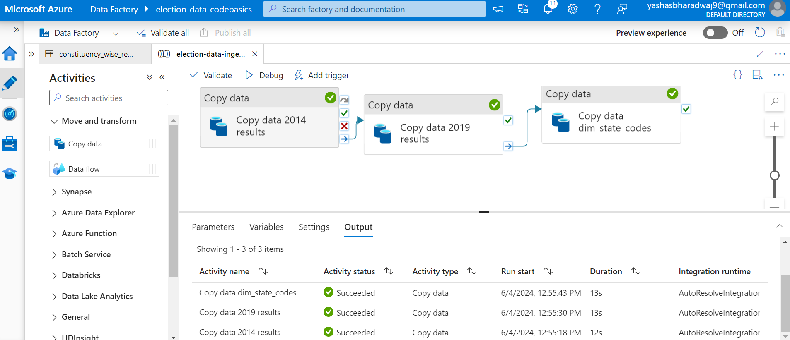
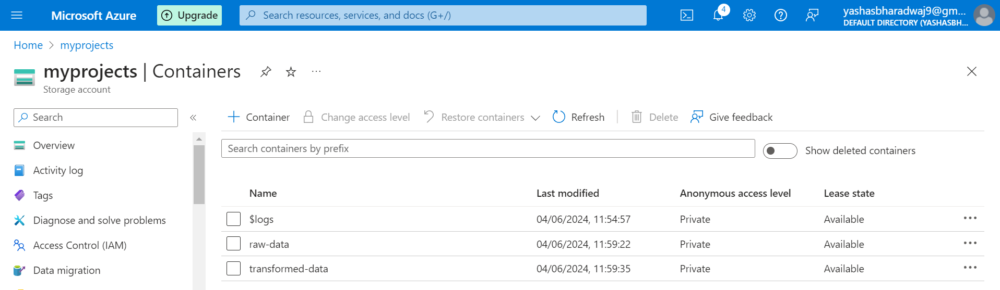

# Election Data Analysis Project

## Overview

This project focuses on analyzing the Indian general election results for the years 2014 and 2019. The analysis includes data ingestion, storage, transformation, and visualization to derive meaningful insights from the election data.

## Datasets

The project utilizes the following datasets:

1. **2014 Election Results:** Contains the election results for the year 2014.
2. **2019 Election Results:** Contains the election results for the year 2019.
3. **State Codes:** Contains the mapping of state names to their respective codes.

## Architecture

I have implemented this project by buiding an ETL pipeline on Azure  

## Data Ingestion

The data ingestion process is automated using Azure Data Factory. The pipeline reads the CSV files, performs necessary transformations, and stores the data in a structured format.

## Raw Data Storage

The raw data is stored in Azure Data Lake Storage Gen2, providing a scalable and secure environment for data storage.

## Data Transformation

The transformation of raw data is planned and executed using PySpark. The transformation process includes cleaning the data, creating dimensions and fact tables, and preparing the data for analysis.

### Transformation Plan

For detailed specifications on the data transformation plan, refer to the [Transformation Plan](./dims_facts_spec_plan).

### PySpark Code

The data transformation is implemented using PySpark. The code can be found in the following notebook:

- [PySpark Transformation Code](./loksabha-elections-DE.ipynb)

## Storing Dimension and fact tables  
The transformed data is stored in Azure Data Lake Storage Gen2 

## Data Visualization

The analysis results are visualized using Power BI, providing interactive dashboards and reports for better understanding and insights.

- [Power BI Dashboard](https://app.powerbi.com/view?r=eyJrIjoiZjlkZGQ2NTUtOWI4Yy00ZWZkLThhNDAtYzVhMTBiODc5NmRmIiwidCI6ImM2ZTU0OWIzLTVmNDUtNDAzMi1hYWU5LWQ0MjQ0ZGM1YjJjNCJ9&pageName=ReportSection)

