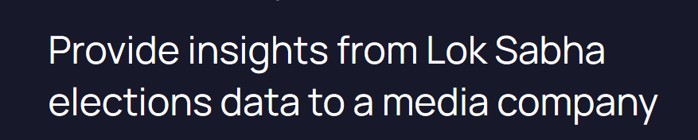

Election Data Analysis:- 

 

Dataset :- 
3 csv files 
2014 results csv ,2019 results csv ,state and its codes csv 
they can be seen in datasets folders 

Data Ingestion:- 
 

Raw Data Storage:-
 
 

Data Transformation :-  
[Transformation Plan](./dims_facts_spec_plan) 

[Pyspark Code](./loksabha-elections-DE.ipynb) 

